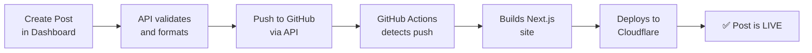

# GitHub CMS Quick Reference

## How the System Works



## Creating Your First Post

1. **Go to Dashboard**
   ```
   https://your-site.com/dashboard
   ```

2. **Login**
   - Use your `ADMIN_PASSWORD`

3. **Navigate to Content**
   - Click "Content" in sidebar
   - Click "Create New Post"

4. **Fill in Post Details**
   - **Title:** Post title (auto-generates slug)
   - **Content:** Write in Markdown
   - **Meta Description:** SEO description (160 chars)
   - **Category:** Choose category
   - **Image:** Featured image URL

5. **Publish & Deploy**
   - Click "Publish & Deploy" button
   - Watch the progress indicator
   - Post will be live in 1-2 minutes

## Environment Variables

### Required Variables

| Variable | Where to Set | Example |
|----------|-------------|---------|
| `GITHUB_TOKEN` | `.env.local` + Cloudflare | `ghp_xxxx...` |
| `GITHUB_OWNER` | `.env.local` + Cloudflare | `your_username` |
| `GITHUB_REPO` | `.env.local` + Cloudflare | `ailodi-wtih-cmx` |
| `ADMIN_PASSWORD` | `.env.local` + Cloudflare | `secure_password` |

### Setup Locations

**Local Development** (`.env.local`):
```bash
GITHUB_TOKEN=ghp_xxxxxxxxxxxxxxxxxxxxxxxxxxxx
GITHUB_OWNER=your_github_username
GITHUB_REPO=ailodi-wtih-cmx
ADMIN_PASSWORD=your_password
```

**Production** (Cloudflare Pages):
1. Go to Pages → Settings → Environment Variables
2. Add variables for both Production & Preview
3. Same values as `.env.local`

## GitHub Setup

### Generate Token
1. Go to https://github.com/settings/tokens
2. Click "Generate new token (classic)"
3. Scopes: `repo` + `workflow`
4. Copy and save immediately

### GitHub Secrets (for Actions)
1. Go to Repo → Settings → Secrets and variables → Actions
2. Add:
   - `CLOUDFLARE_API_TOKEN` - from Cloudflare
   - `CLOUDFLARE_ACCOUNT_ID` - from Cloudflare

## Cloudflare Setup

### Environment Variables
Settings → Environment Variables (both Production & Preview):
- `GITHUB_TOKEN`
- `GITHUB_OWNER`
- `GITHUB_REPO`
- `GITHUB_BRANCH` (usually `main`)
- `ADMIN_PASSWORD`

### Secrets for GitHub Actions
In your GitHub repo secrets:
- `CLOUDFLARE_API_TOKEN` - API token with Pages deploy permission
- `CLOUDFLARE_ACCOUNT_ID` - Your Cloudflare account ID

## Project Structure

```
.github/
  workflows/
    deploy.yml              ← Main workflow
    deploy-content.yml      ← Content-only workflow

content/
  posts/
    your-post-slug.md       ← Posts stored here as Markdown

functions/
  api/
    posts/
      create.js             ← POST /api/posts/create

app/
  dashboard/
    content/
      create/
        page.tsx            ← Create post UI

lib/
  github.ts                 ← GitHub API integration
```

## File Locations

| File | Purpose |
|------|---------|
| `GITHUB_CMS_SETUP.md` | Full setup guide |
| `GITHUB_CMS_SETUP_CHECKLIST.md` | Quick checklist |
| `.env.example` | Environment variables template |
| `.github/workflows/deploy.yml` | Main deployment workflow |
| `functions/api/posts/create.js` | Post creation API |
| `app/dashboard/content/create/page.tsx` | Create post form |

## Common Commands

```bash
# Local development
npm run dev

# Build locally
npm run build

# Generate metadata
npm run generate-metadata

# Build with metadata
npm run build:metadata

# Preview production build
npm run preview
```

## Deployment Flow

1. **Submit form** → `/api/posts/create`
2. **API validates** → Checks required fields
3. **Push to GitHub** → Creates/updates `content/posts/{slug}.md`
4. **GitHub detects push** → Triggers workflow
5. **Workflow builds** → Runs `npm run build:metadata`
6. **Deploy to Cloudflare** → Uses `wrangler pages deploy`
7. **Site rebuilt** → New post is live

**Total time:** ~1-2 minutes

## Debugging

### Check GitHub Actions
1. Go to GitHub repo
2. Click "Actions" tab
3. See all workflow runs
4. Click run for logs

### Check Cloudflare Deployment
1. Go to Pages project
2. Click "Deployments" tab
3. See deployment history
4. Click deployment for logs

### Local Testing
```bash
npm run dev
# Test at http://localhost:3000/dashboard
```

## Post Frontmatter Format

Posts are automatically saved with this format:

```markdown
---
title: Your Post Title
slug: your-post-slug
metaDescription: SEO description
featuredImageUrl: https://...
category: Blog
author: Admin
createdAt: 2024-11-20
updatedAt: 2024-11-20
---

# Your post content in Markdown

Write your content here...
```

## Troubleshooting

### Post not appearing
- [ ] Wait 2 minutes for deployment
- [ ] Clear browser cache (Ctrl+Shift+R)
- [ ] Check GitHub Actions for errors
- [ ] Check post frontmatter format

### "GitHub config missing" error
- [ ] Verify `GITHUB_TOKEN` is set
- [ ] Verify `GITHUB_OWNER` is correct
- [ ] Verify `GITHUB_REPO` is correct
- [ ] Check Cloudflare environment variables

### Authentication fails
- [ ] Clear cookies
- [ ] Re-login with correct password
- [ ] Check `ADMIN_PASSWORD` matches everywhere

### Workflow not running
- [ ] Verify workflow files are in `main` branch
- [ ] Check GitHub Actions is enabled
- [ ] Verify GitHub secrets are set

## Security Notes

✅ Never commit:
- `.env.local` file
- API tokens or secrets

✅ Best practices:
- Use strong `ADMIN_PASSWORD`
- Rotate GitHub token yearly
- Keep repository private if needed
- Review workflow logs regularly

## Next Steps

1. **Complete Setup** → Follow `GITHUB_CMS_SETUP_CHECKLIST.md`
2. **Test Locally** → Create test post in local dev
3. **Deploy to Production** → Test on live site
4. **Configure Optional Features** → Edit/delete posts, scheduling, etc.

## Need Help?

See `GITHUB_CMS_SETUP.md` for detailed instructions.
